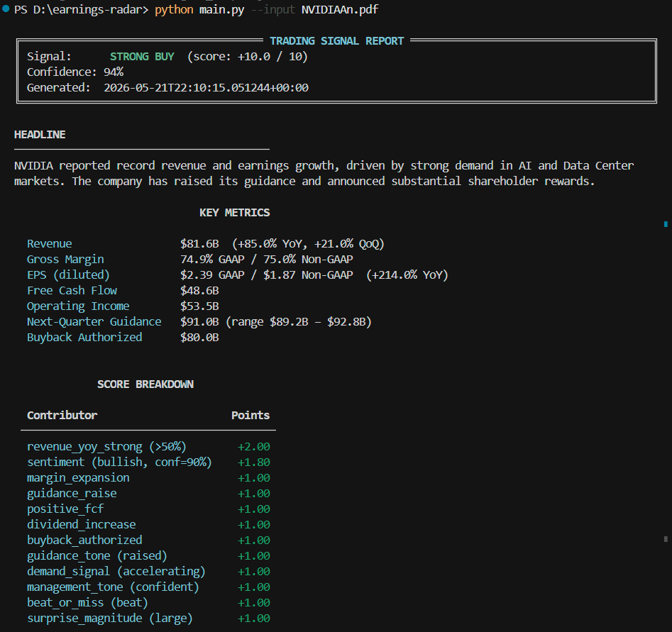
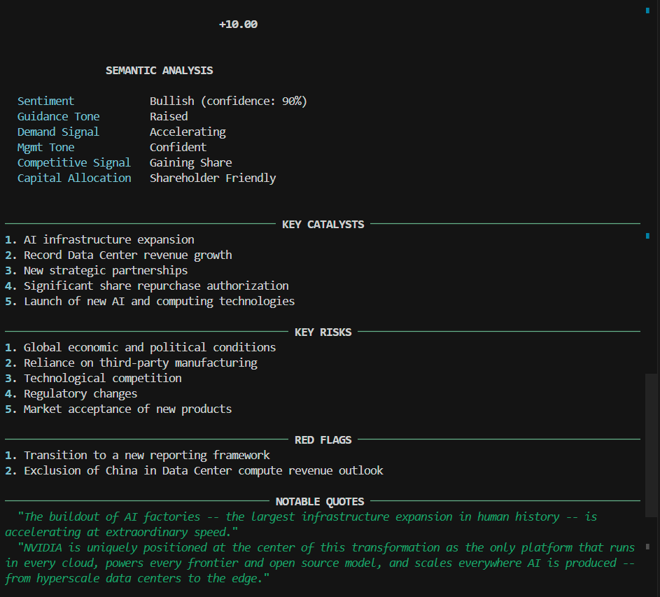
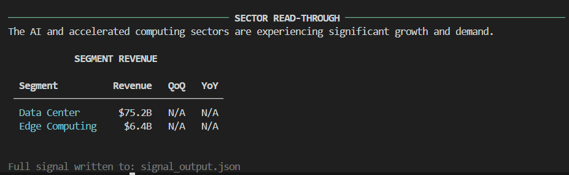

# Earnings Radar - Trading Signal System

A two-layer financial document parser that ingests earnings releases, 10-Ks, press releases,
and similar documents and emits a structured trading signal with a score, confidence rating,
and full analytical breakdown.

---

## Architecture

```
Document (PDF / TXT / HTML)
        │
        ▼
 document_loader.py          ← pdfplumber / PyMuPDF / BeautifulSoup
        │
        ├──────────────────────────────────┐
        ▼                                  ▼
deterministic_parser.py         semantic_parser.py
  (regex + numeric rules)         (OpenAI gpt-4o)
        │                                  │
        └──────────────┬───────────────────┘
                       ▼
              signal_aggregator.py
                       │
                       ▼
                  output.py
          (rich terminal + JSON file)
```

### Layer 1 - Deterministic Parser
Rule-based extraction using regex and numeric parsing. Extracts revenue figures, margins,
EPS, guidance, cash flow, segment data, and shareholder return signals. Works with no API key.

### Layer 2 - Semantic Parser
Sends the full document text to `gpt-4o` and receives a structured JSON response covering
sentiment, guidance tone, demand signals, catalysts, risks, red flags, and sector read-through.

### Signal Aggregator
Combines both layers into a scored decision ranging from -10 (strong sell) to +10 (strong buy),
then classifies the final signal into one of seven tiers:

| Score   | Signal      |
|---------|-------------|
| ≥ 6     | STRONG BUY  |
| 3 – 5   | BUY         |
| 1 – 2   | WEAK BUY    |
| 0       | HOLD        |
| -1 – -2 | WEAK SELL   |
| -3 – -5 | SELL        |
| ≤ -6    | STRONG SELL |

---

## Setup

### Requirements
- Python 3.10+

### Install dependencies

```bash
pip install -r requirements.txt
```

### Set your OpenAI API key

The semantic layer requires an OpenAI API key exported as an environment variable:

**Windows (PowerShell)**
```powershell
$env:OPENAI_API_KEY = "sk-..."
```

**Linux / macOS**
```bash
export OPENAI_API_KEY="sk-..."
```

If the key is not set the system will skip the semantic layer and produce a
deterministic-only signal with a note in the confidence score.

---

## Usage

```bash
# Basic usage
python main.py --input NVIDIAAn.pdf

# Specify output file
python main.py --input NVIDIAAn.pdf --output nvidia_q1_fy27.json

# Provide consensus estimate for guidance vs. consensus calculation
python main.py --input NVIDIAAn.pdf --consensus-revenue 79.5

# Skip LLM layer (deterministic only, no API key required)
python main.py --input NVIDIAAn.pdf --no-semantic

# Enable verbose / debug logging
python main.py --input NVIDIAAn.pdf --verbose
```

### Supported input formats
| Extension | Parser used              |
|-----------|--------------------------|
| `.pdf`    | pdfplumber → PyMuPDF     |
| `.txt`    | Plain text read          |
| `.html` / `.htm` | BeautifulSoup    |

---

## Output

### Terminal report
A rich-formatted report is printed to stdout with:
- Signal classification and score
- Headline summary (from LLM)
- Key financial metrics table
- Score breakdown by contributor
- Semantic analysis (sentiment, guidance tone, demand signal, management tone)
- Key catalysts and risks
- Red flags
- Notable management quotes
- Sector read-through
- Segment revenue (where parsed)

### JSON file (`signal_output.json`)
The full `TradingSignal` object serialized to JSON, including all raw deterministic and
semantic metrics, the score breakdown dictionary, and the ISO timestamp.

---

## Configuration and Extending Score Weights

All thresholds and weights live in `config.py`. Edit values there to tune signal sensitivity
without touching business logic.

### Deterministic thresholds

```python
# config.py
REVENUE_YOY_STRONG_THRESHOLD   = 50.0   # % — revenue up >50% YoY earns +2 pts
REVENUE_YOY_MODERATE_THRESHOLD = 20.0   # % — revenue up >20% YoY earns +1 pt
GROSS_MARGIN_FLOOR             = 50.0   # % — below earns -1 pt
```

### Deterministic point weights

```python
DET_WEIGHTS = {
    "revenue_yoy_strong":    2.0,
    "revenue_yoy_moderate":  1.0,
    "margin_expansion":      1.0,
    "guidance_raise":        1.0,
    "positive_fcf":          1.0,
    "dividend_increase":     1.0,
    "buyback_authorized":    1.0,
    "revenue_yoy_negative": -2.0,
    "low_gross_margin":     -1.0,
}
```

### Semantic point weights

```python
SEM_WEIGHTS = {
    "sentiment": {"bullish": 2.0, "neutral": 0.0, "bearish": -2.0},
    "guidance_tone": {"raised": 1.0, "maintained": 0.0, "lowered": -2.0, "withdrawn": -3.0},
    "demand_signal": {"accelerating": 1.0, "stable": 0.0, "decelerating": -1.0},
    "management_tone": {"confident": 1.0, "mixed": 0.0, "cautious": -1.0, "defensive": -2.0},
    "beat_or_miss": {"beat": 1.0, "in-line": 0.0, "miss": -2.0},
    ...
}
```

Sentiment points are **weighted by `sentiment_confidence`** before being added to the score,
so a low-confidence bullish reading contributes less than a high-confidence one.

### Score bands

```python
SCORE_BANDS = {
    "STRONG_BUY":  6.0,
    "BUY":         3.0,
    "WEAK_BUY":    1.0,
    "HOLD":        0.0,
    "WEAK_SELL":  -2.0,
    "SELL":        -5.0,
    "STRONG_SELL": float("-inf"),
}
```

---

## Project Structure

```
earnings-radar/
├── main.py                 # CLI entrypoint
├── config.py               # All thresholds and model settings
├── models.py               # Dataclasses and enums
├── document_loader.py      # PDF / TXT / HTML ingestion
├── deterministic_parser.py # Regex-based metric extraction
├── semantic_parser.py      # OpenAI LLM parsing
├── signal_aggregator.py    # Score computation and signal classification
├── output.py               # Rich terminal renderer + JSON writer
├── requirements.txt
└── README.md
```

---

## Extending the System

- **Add a new document type**: update `_TYPE_PATTERNS` in `document_loader.py`
- **Add new deterministic metrics**: add a field to `DeterministicMetrics` in `models.py`,
  implement a `_parse_*` function in `deterministic_parser.py`, and wire it in `parse()`
- **Add a new scoring dimension**: add a field to `SEM_WEIGHTS` / `DET_WEIGHTS` in `config.py`
  and update the corresponding scorer in `signal_aggregator.py`
- **Change the LLM model**: set `OPENAI_MODEL` in `config.py`
- **Use a different LLM provider**: replace the OpenAI client calls in `semantic_parser.py`
  while keeping the same `SemanticMetrics` return type

---

## Test Case: NVIDIA Q1 FY2027 (ended April 26, 2026)

```bash
python main.py --input NVIDIAAn.pdf --consensus-revenue 79.5
```

Deterministic layer extracts (verified):

| Metric | Value |
|--------|-------|
| Revenue | $81.6B (+85% YoY, +21% QoQ) |
| Gross Margin | 74.9% GAAP / 75.0% Non-GAAP |
| EPS (diluted) | $2.39 GAAP / $1.87 Non-GAAP (+214% YoY) |
| Free Cash Flow | $48.6B |
| Operating Income | $53.5B |
| Q2 Guidance | $91.0B ± 2% |
| Buyback Authorized | $80.0B |
| Data Center Revenue | $75.2B |
| Edge Computing Revenue | $6.4B |

Semantic layer (with API key) returns bullish sentiment, raised guidance tone,
accelerating demand, and flags the China revenue exclusion from guidance as a red flag.

Final signal: **STRONG BUY** with high confidence.

---

## Output Screenshots






